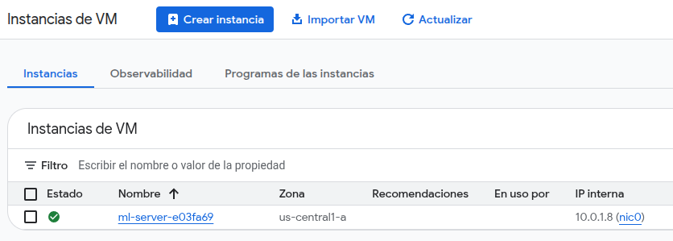
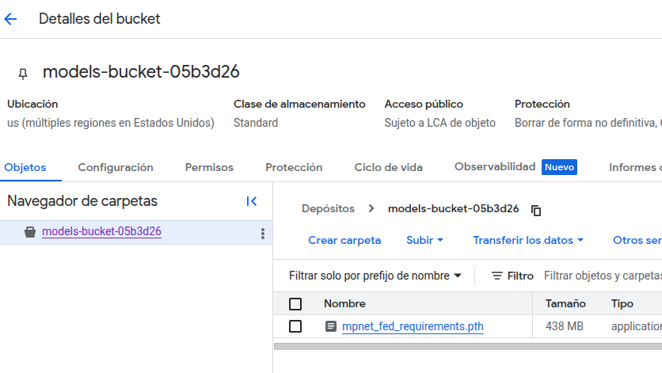
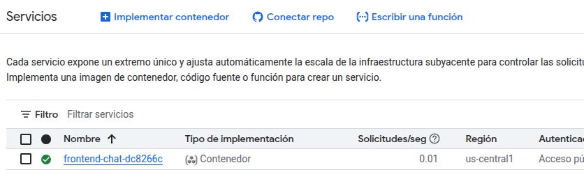
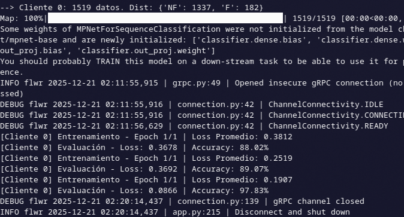
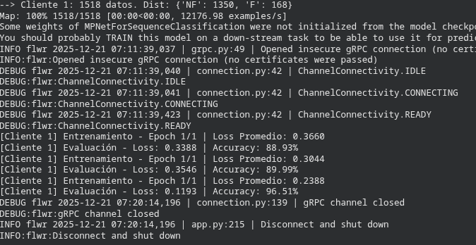
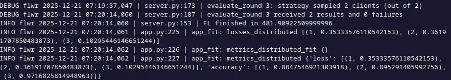
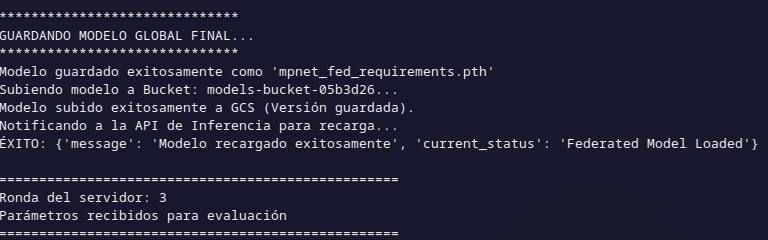
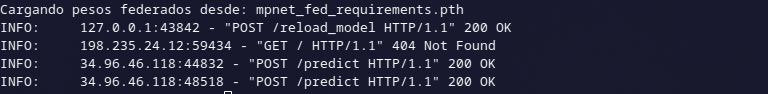
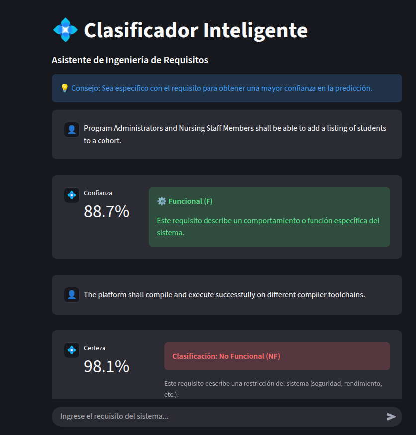

# Federated Learning - Requirements Classification Project

Este proyecto implementa un sistema completo de **Aprendizaje Federado (Federated Learning)** para entrenar un modelo de Procesamiento de Lenguaje Natural (NLP) basado en **MPNet**. El objetivo es clasificar requisitos de software en **Funcionales (F)** y **No Funcionales (NF)** de manera colaborativa, preservando la privacidad de los datos de los clientes.

El sistema utiliza una arquitectura híbrida con **Google Cloud Platform (GCP)** para el servidor central y la infraestructura, y clientes locales que entrenan con sus propios datos. Todo el despliegue está automatizado mediante **Infrastructure as Code (IaC)** con Pulumi.

## Estructura del Proyecto

El proyecto está organizado de la siguiente manera para separar la lógica de infraestructura, servidor y cliente:

```cmd
my-fl-project/
├── app/                        # Código que se ejecuta en la Máquina Virtual (VM)
│   ├── inference_api.py        # API FastAPI que sirve el modelo para predicciones en tiempo real.
│   └── server.py               # Servidor Flower que orquesta el entrenamiento y agrega los pesos.
├── infra/                      # Infraestructura como Código (Pulumi)
│   ├── index.ts                # Definición de recursos (VM, Buckets, Redes, Cloud Run).
│   ├── package.json            # Dependencias de Node.js para Pulumi.
│   ├── Pulumi.yaml             # Configuración del proyecto Pulumi.
│   └── startup.sh              # Script de inicio de la VM (instala dependencias y arranca servicios).
├── frontend/                   # (Implícito en tu Dockerfile) Interfaz de Usuario
│   ├── app.py                  # Interfaz de chat con Streamlit.
│   └── Dockerfile              # Configuración para containerizar el frontend.
├── client.py                   # Script del cliente que entrena el modelo localmente.
└── dataset.csv                 # Datos locales (PROMISE_extended6.csv) para entrenamiento.

```

### Descripción de Archivos Clave

- **`server.py`**: Inicia el servidor `flwr`, gestiona las rondas de entrenamiento, agrega los pesos de los modelos de los clientes, guarda el modelo final (`.pth`) y lo sube automáticamente al Bucket de GCP.
- **`inference_api.py`**: Una API REST construida con FastAPI. Carga el modelo entrenado (desde disco o descargándolo del Bucket) y ofrece un endpoint `/predict` para clasificar texto nuevo.
- **`client.py`**: Se ejecuta en las máquinas locales de los usuarios. Carga los datos, entrena el modelo usando la GPU local y envía solo los pesos (no los datos) al servidor.
- **`index.ts`**: El cerebro de la infraestructura. Crea la red VPC, el firewall, la VM para el servidor, el Bucket de almacenamiento y despliega el Frontend en Cloud Run.

---

## Despliegue de Infraestructura (IaC con Pulumi)

Utilizamos **Pulumi** para crear toda la infraestructura en Google Cloud con un solo comando.

### 1. Prerrequisitos y Configuración

Asegúrate de tener instalado `gcloud CLI`, `pulumi` y `docker`.

```bash
# Autenticarse en Google Cloud
gcloud auth login
gcloud config set project project-id

# Habilitar servicios necesarios
gcloud services enable run.googleapis.com cloudbuild.googleapis.com containerregistry.googleapis.com compute.googleapis.com
gcloud auth configure-docker
```

### 2. Ejecutar Pulumi

Navega a la carpeta `infra/` y ejecuta:

```bash
cd infra

# Inicializar stack (solo la primera vez)
pulumi login --local
pulumi stack init dev

# Configurar variables de región y proyecto
pulumi config set gcp:project mi-app-tofu-123456
pulumi config set gcp:region us-central1

# Instalar dependencias y desplegar
npm install
pulumi install
pulumi up
```

### ¿Qué hace Pulumi internamente?

Al ejecutar `pulumi up`, el script `index.ts` realiza automáticamente lo siguiente:

1. **Crea un Bucket GCS:** Llamado `models-bucket` con control de versiones activado para guardar los modelos entrenados.
2. **Configura la Red:** Crea una VPC y subred segura, abriendo solo los puertos necesarios (22 SSH, 8080 Flower, 8000 API).
3. **Aprovisiona la VM (Compute Engine):** Levanta una instancia Debian, inyecta el código de `server.py` e `inference_api.py` y ejecuta el `startup.sh` para instalar dependencias Python y arrancar los servicios.
4. **Despliega el Frontend (Cloud Run):** Construye la imagen Docker de la app de Streamlit, la sube al registro y la despliega como un servicio Serverless público, conectándolo automáticamente con la IP de la VM.

---

## Recursos en Google Cloud

Una vez finalizado el despliegue, tendrás los siguientes recursos operativos:

### Máquina Virtual (ML Server)

Encargada de orquestar el entrenamiento y servir la API de inferencia.



### Storage Bucket

Almacén persistente donde el servidor guarda automáticamente el modelo `mpnet_fed_requirements.pth` al finalizar el entrenamiento. Esto asegura que el modelo sobreviva si la VM se reinicia.



### Cloud Run (Frontend)

Interfaz web accesible públicamente que permite a los usuarios interactuar con el modelo.



---

## Ejecución de Clientes (Entrenamiento)

Para iniciar el proceso de aprendizaje federado, necesitas ejecutar clientes locales que se conecten al servidor en la nube.

### 1. Preparar Entorno Local (Con soporte GPU)

```bash
# 1. Crear entorno conda
conda create -n fl-gpu python=3.10 -y
conda activate fl-gpu

# 2. Instalar PyTorch con soporte CUDA (Ajustar versión según tus drivers)
pip install torch torchvision torchaudio --index-url https://download.pytorch.org/whl/cu124

# 3. Instalar librerías del proyecto
pip install flwr==1.5.0 transformers datasets pandas numpy scikit-learn accelerate

# 4. Verificar GPU
python -c "import torch; print(f'CUDA disponible: {torch.cuda.is_available()}'); print(f'GPU: {torch.cuda.get_device_name(0)}')"
```

---

### 2. Configurar y Ejecutar Clientes

Edita el archivo `client.py` en tu entorno local y actualiza la variable `SERVER_PUBLIC_IP` con la dirección IP pública que te devolvió Pulumi (output `backendIp`).

```python
# client.py
# ...
SERVER_PUBLIC_IP = "34.171.XXX.XXX" # <--- Reemplazar con tu IP de VM en Gcloud
# ...
```

Abre dos terminales diferentes y ejecuta un cliente en cada una:

```bash
# Terminal 1
python client.py 0

# Terminal 2
python client.py 1

```

El servidor espera un mínimo de 2 clientes. Una vez conectados, comenzará el entrenamiento federado.

Aquí verás cómo cada cliente entrena con sus datos locales y envía los pesos al servidor.





---

### 3. Verificación en el Servidor (Logs de VM)

Una vez finalizado el entrenamiento, puedes acceder a la Máquina Virtual en Google Cloud para verificar que todo ocurrió correctamente en el lado del servidor.

Primero, conéctate vía SSH:

```bash
gcloud compute ssh --zone "us-central1-a" "ml-server-XXXX" --project "mi-app-tofu-123456"

```

#### A. Verificar Entrenamiento y Subida al Bucket

Ejecuta el siguiente comando para ver el log del servidor Flower. Aquí podrás confirmar que las rondas finalizaron y que el modelo se subió a Google Cloud Storage.

```bash
cat /app/server.log
```



_El log muestra las métricas de las 3 rondas y el mensaje de éxito al guardar el modelo._



_Al final del log, se confirma la subida automática al Bucket para persistencia._

#### B. Verificar API de Inferencia

Ejecuta este comando para ver el log de la API. Aquí confirmarás que la API recibió la notificación del servidor y recargó el nuevo modelo "en caliente" sin apagarse.

```bash
cat /app/api.log
```



_El log muestra que la API inició correctamente y luego procesó la petición `/reload_model` exitosamente._

---

## Inferencia y Pruebas

Una vez que el entrenamiento finaliza (3 rondas por defecto), el servidor guarda el modelo y recarga la API automáticamente. Puedes ir a la URL proporcionada por Cloud Run para probar el modelo.

**Interfaz Web:**
Escribe un requisito y el sistema te dirá si es Funcional o No Funcional junto con el nivel de confianza.



---

## Author

- **Braulio Nayap Maldonado Casilla** - [GitHub Profile](https://github.com/ShinjiMC)
- **Sergio Daniel Mogollon Caceres** - [GitHub Profile](https://github.com/i-am-sergio)

## License

This project is licensed under the MIT License. See the [LICENSE](LICENSE) file for details.
