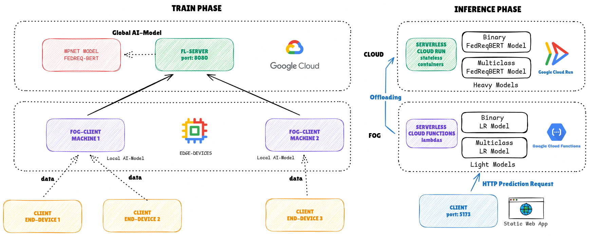
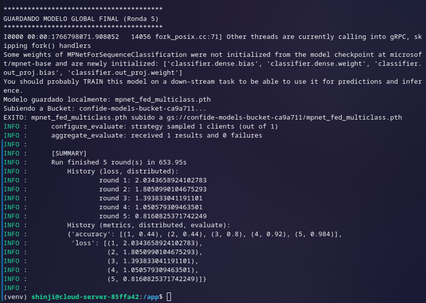
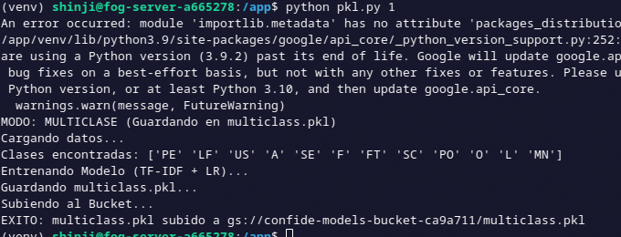
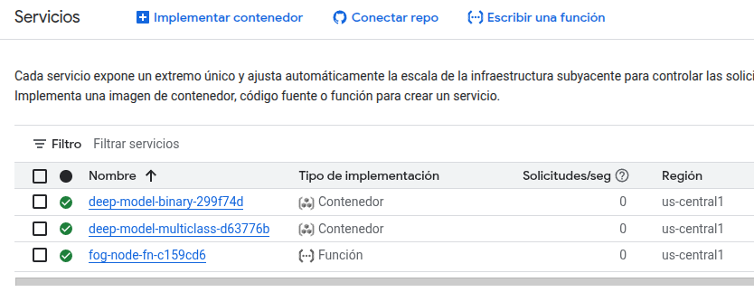
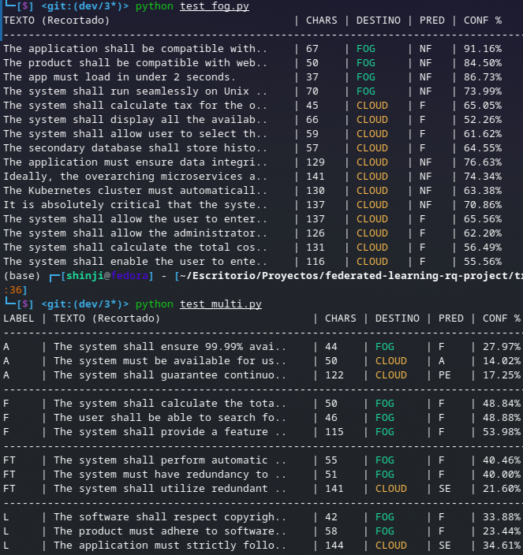
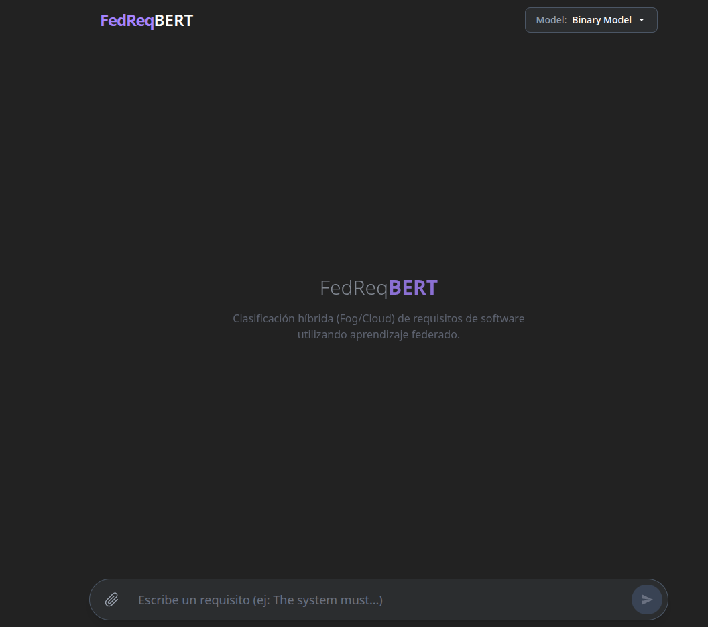
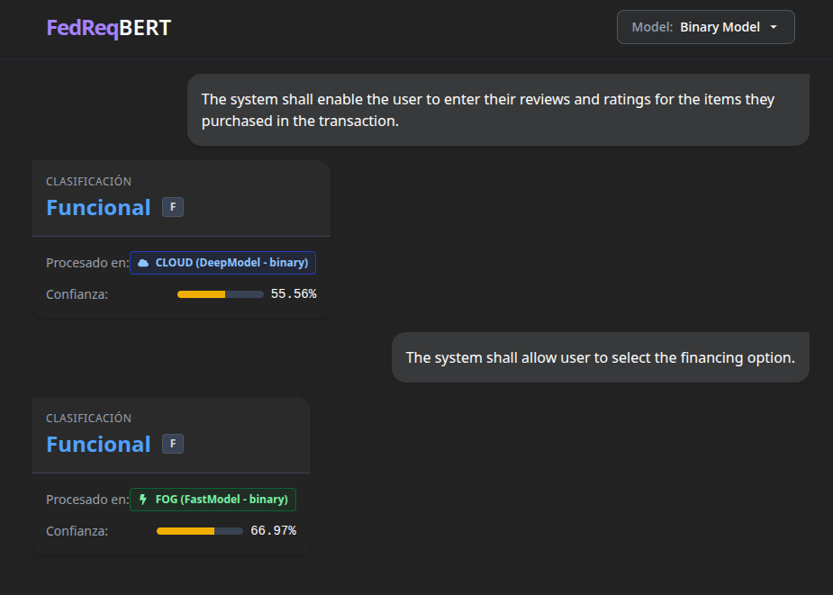
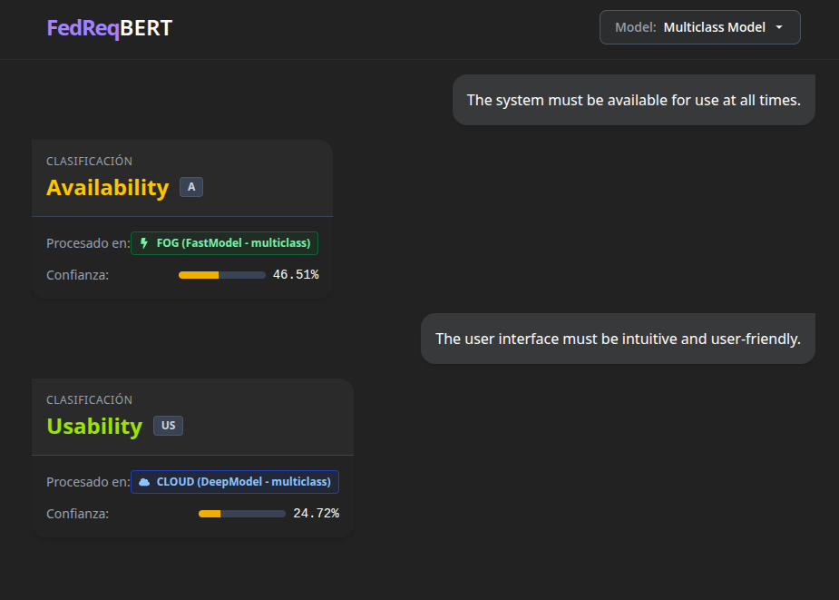

# Federated Learning and Computation Offloading for Requirements Classification

Este documento detalla los procedimientos necesarios para desplegar la infraestructura, configurar el entorno de Aprendizaje Federado (FL) y desplegar los servicios de inferencia serverless para el sistema de clasificación de requisitos.



## 1. Prerrequisitos y Configuración Inicial

Antes de iniciar el despliegue, asegúrese de tener instalada la CLI de Google Cloud (`gcloud`) y Pulumi. Es necesario autenticarse y configurar los permisos adecuados.

```bash
# Iniciar sesión en Google Cloud
gcloud auth login

# Configurar credenciales por defecto para las aplicaciones
gcloud auth application-default login

# Habilitar servicios necesarios (Compute Engine, Cloud Run, Artifact Registry, etc.)
gcloud services enable compute.googleapis.com \
                       run.googleapis.com \
                       artifactregistry.googleapis.com \
                       cloudbuild.googleapis.com \
                       storage.googleapis.com \
                       iam.googleapis.com
```

## 2. Fase 1: Despliegue de Infraestructura de Entrenamiento

Esta fase aprovisiona los servidores virtuales (Cloud y Fog) y el almacenamiento (Bucket) necesarios para el entrenamiento del modelo.

### 2.1. Aprovisionamiento con Pulumi

Acceda al directorio de infraestructura e inicie el despliegue.

```bash
cd infrastructure

# Instalar dependencias del proyecto Pulumi
npm install

# Desplegar la pila de recursos
pulumi up

```


> **Nota:** Al finalizar, el output mostrará las direcciones IP públicas de las máquinas virtuales creadas y el nombre del Bucket. Tome nota de estos valores.

## 3. Fase 2: Configuración del Aprendizaje Federado

Esta etapa configura los nodos servidor y cliente para ejecutar el ciclo de entrenamiento federado.

### 3.1. Configuración del Servidor Cloud (Orquestador)

Conéctese a la máquina virtual designada como servidor Cloud y configure el script de orquestación.

1. **Conexión SSH:**

```bash
gcloud compute ssh <CLOUD_VM_NAME> --zone us-central1-a
```

2. **Despliegue del Código:**
   Navegue al directorio de la aplicación y cree el archivo `server.py` con el contenido de `train/fl_server.py`.

```bash
cd /app
nano server.py
# Copie el contenido de train/fl_server.py en server.py
```

3. **Ejecución:**
   Active el entorno virtual y ejecute el servidor.

```bash
source /app/venv/bin/activate
python server.py
```

### 3.2. Configuración del Servidor Fog (Cliente)

Conéctese a la máquina virtual designada como servidor Fog, cargue el dataset y configure el cliente de entrenamiento.

1. **Transferencia del Dataset:**
   Desde su máquina local, suba el archivo de datos al servidor Fog.

```bash
gcloud compute scp promise_nfr.csv <FOG_VM_NAME>:~/ --zone us-central1-b
```

2. **Conexión SSH:**

```bash
gcloud compute ssh <FOG_VM_NAME> --zone us-central1-b
```

3. **Despliegue del Código:**
   Navegue al directorio de la aplicación y cree el archivo `client.py` con el contenido de `train/fl_client.py`.

```bash
cd /app
nano client.py
# Copie el contenido de train/fl_client.py en client.py
```

4. **Ejecución del Entrenamiento Federado:**
   Active el entorno y ejecute el cliente. El argumento final define el modo (Binario o Multiclase).

- **Modo Binario:**

```bash
source /app/venv/bin/activate
python client.py <CLIENT_ID>
```

- **Modo Multiclase:**

```bash
source /app/venv/bin/activate
python client.py <CLIENT_ID> 1
```



## 4. Fase 3: Entrenamiento del Modelo Ligero (Fog)

Una vez completado el ciclo federado, se debe entrenar y serializar el modelo ligero (Regresión Logística) en el nodo Fog para su posterior uso en la fase de inferencia.

1. **Configuración del Script:**
   En el servidor Fog, cree el archivo `light.py` con el contenido de `train/pkl.py`.

   ```bash
   cd /app
   nano light.py
   # Copie el contenido de train/pkl.py en light.py
   ```

2. **Configuración de Variables de Entorno:**
   Edite `light.py` para asegurar que la variable `BUCKET_NAME` apunte al bucket creado en la Fase 1.

```python
BUCKET_NAME = os.environ.get("MODEL_BUCKET_NAME", "confide-models-bucket-ID")
```

3. **Ejecución y Serialización:**
   Ejecute el script para entrenar el modelo local, serializarlo y subirlo automáticamente al Bucket.

- **Modo Binario:** `python light.py`
- **Modo Multiclase:** `python light.py 1`



## 5. Fase 4: Despliegue de Infraestructura de Inferencia Serverless

Esta fase despliega los servicios de Cloud Run que servirán los modelos a través de una API, optimizando los tiempos de arranque mediante la pre-descarga de tensores.

### 5.1. Preparación del Modelo Base

Antes de desplegar, es necesario descargar localmente los artefactos del modelo Transformer para incluirlos en la imagen del contenedor y evitar latencias de descarga en tiempo de ejecución.

1. Acceda al directorio `inference-serverless`.
2. Cree un entorno virtual (Python 3.12) e instale las dependencias necesarias (`transformers`, `torch`).

   ```bash
   python3 -m venv venv
   source venv/bin/activate
   pip install transformers torch
   ```

3. Ejecute el script de descarga:

```bash
python download_template.py
```

Esto generará el directorio `model_base_template` con los tensores necesarios.

### 5.2. Configuración de Pulumi para Inferencia

1. **Instalación de Dependencias:**

```bash
npm install
```

2. **Configuración de Recursos:**
   Edite el archivo `index.ts` para referenciar el bucket correcto y el directorio del modelo base.

```typescript
const bucketName = "confide-models-bucket-ID"; // Nombre del bucket creado en Fase 1
const baseModelDir = "./model_base_template";
```

3. **Configuración de Docker:**
   Asegúrese de configurar la autenticación de Docker para Google Cloud.

```bash
gcloud auth configure-docker
gcloud services enable compute.googleapis.com \
                       run.googleapis.com \
                       artifactregistry.googleapis.com \
                       cloudbuild.googleapis.com \
                       storage.googleapis.com \
                       iam.googleapis.com
```

4. **Despliegue:**

```bash
pulumi up
```



Este proceso desplegará dos servicios de Cloud Run (uno para inferencia binaria y otro para multiclase). La aplicación web interactuará con estos servicios, los cuales descargarán dinámicamente los pesos específicos (entrenados en las Fases 2 y 3) desde el Bucket, optimizando el rendimiento mediante el uso de una base del modelo pre-cargada en el contenedor.

## 6. Verificación y Pruebas Manuales

Para validar el funcionamiento de los modelos desplegados en el nodo Fog y su interacción con la nube sin depender de la interfaz web, se pueden ejecutar los scripts de prueba dedicados.

### 6.1. Prueba de Clasificación Binaria

Ejecute el siguiente script para enviar una solicitud de prueba al modelo de clasificación binaria (Funcional vs. No Funcional):

```bash
python test_fog.py

```

### 6.2. Prueba de Clasificación Multiclase

Ejecute el siguiente script para verificar el comportamiento del modelo en la tarea de clasificación de 12 clases:

```bash
python test_multi.py

```

> **Salida Esperada:** Los scripts devolverán la etiqueta predicha, el nivel de confianza y el origen de la respuesta (Fog o Cloud), similar a lo mostrado en la siguiente captura:



## 7. Interfaz de Usuario

El sistema incluye una aplicación web estática que actúa como cliente final, permitiendo a los usuarios ingresar requisitos en lenguaje natural y visualizar la clasificación en tiempo real.

### 7.1. Vista General

La interfaz principal presenta el estado de los servicios y permite seleccionar el modo de operación.



### 7.2. Clasificación Binaria

Ejemplo de inferencia en modo binario, mostrando la distinción entre requisitos funcionales y no funcionales.



### 7.3. Clasificación Multiclase

Ejemplo de inferencia en modo multiclase, donde se categoriza el requisito en una de las 12 clases específicas del dominio.



---

## Author

- **Sergio Daniel Mogollon Caceres** - [GitHub Profile](https://github.com/i-am-sergio)
- **Braulio Nayap Maldonado Casilla** - [GitHub Profile](https://github.com/ShinjiMC)

## License

This project is licensed under the MIT License. See the [LICENSE](LICENSE) file for details.
